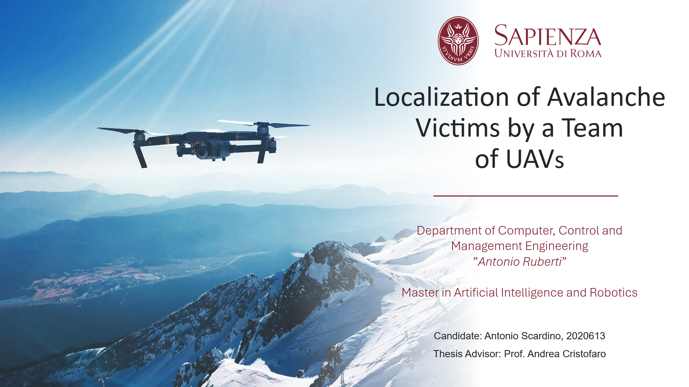

# 🎓 Localization of Avalanche Victims by a Team of UAVs 

  

## 📌 Overview  

This repository contains the **thesis work** on **decentralized UAV swarm control** for **multi-source localization of avalanche victims**. The approach leverages **Particle Swarm Optimization (PSO)** and **Recursive Least Squares (RLS)** to estimate victim positions using electromagnetic signals.  

### **Key Highlights**  
- 🛰 **Swarm Intelligence** applied to rescue operations  
- 📡 **Electromagnetic signal processing** for localization
- 🚁 **Drone flight autonomous control**
- ⚡ **PSO & RLS optimization algorithms**  
- 🔍 **Decentralized control strategy**  

---

## 🎥 Simulations  
  
- **Exploration Phase:**  
  

- **Exploitation Phase:**  


---

## 📜 Thesis Details  

- 🎓 **Institution:** La Sapienza University of Rome  
- 📅 **Year:** 2025  
- 👨‍🏫 **Supervisor:** Andrea Cristofaro 
- 📄 **Thesis Document:** [Download PDF](LaTeX/main.pdf)  

---

### **📌 How to Run the Code**  

#### 👤 Multiple Victims Case  
```bash
git clone https://github.com/your-repo/thesis.git
cd PSO_superpos
matlab -r "main"
  ```

#### 👥 Single Victims Case 
```bash
cd ../RLS_indipendent && matlab -r "main"
  ```